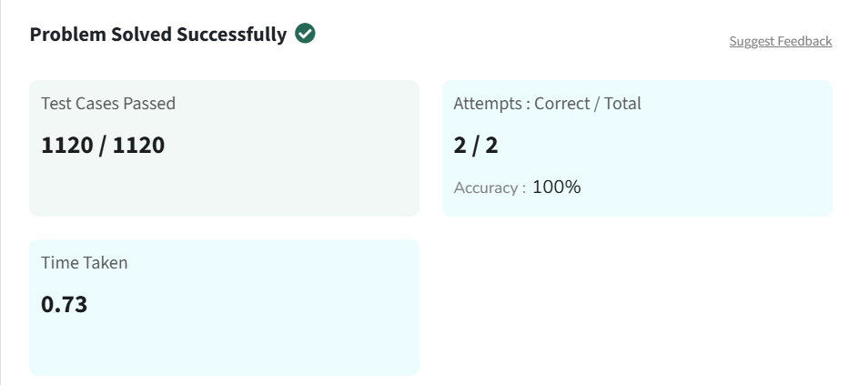

# Kadane's Algorithm

You are given an integer array `arr[]`. You need to find the **maximum sum of a subarray** (containing at least one element) in the array `arr[]`.

**Note:** A subarray is a **continuous part** of an array.

---

## Examples

**Input:**  
arr[] = [2, 3, -8, 7, -1, 2, 3]

**Output:**  
11

**Explanation:**  
The subarray **[7, -1, 2, 3]** has the largest sum **11**.

---

**Input:**  
arr[] = [-2, -4]

**Output:**  
-2

**Explanation:**  
The subarray **[-2]** has the largest sum **-2**.

---

**Input:**  
arr[] = [5, 4, 1, 7, 8]

**Output:**  
25

**Explanation:**  
The subarray **[5, 4, 1, 7, 8]** has the largest sum **25**.

---

## Constraints

1 ≤ arr.size() ≤ 10⁵  
-10⁴ ≤ arr[i] ≤ 10⁴  

---

## Solution

```python
class Solution:
    def maxSubarraySum(self, arr):
        max_sum = arr[0]
        curr_sum = arr[0]
        
        for i in range(1, len(arr)):
            curr_sum = max(arr[i], curr_sum + arr[i])
            max_sum = max(max_sum, curr_sum)
            
        return max_sum
```

## Problem Solved Screenshot

