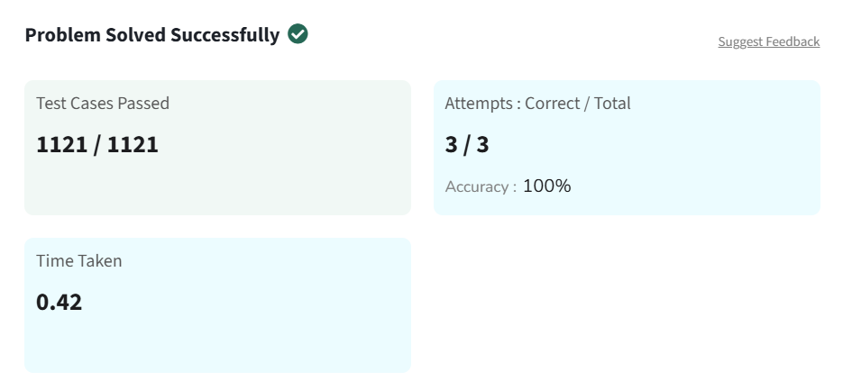

# Kth Smallest Element in Array

## Problem Statement

Given an integer array `arr[]` and an integer `k`, your task is to find and return the **kth smallest element** in the given array.

**Note:** The kth smallest element is determined based on the **sorted order of the array**.

---

## Examples

**Input:**  
arr[] = [10, 5, 4, 3, 48, 6, 2, 33, 53, 10], k = 4

**Output:**  
5

**Explanation:**  
The sorted array is `[2, 3, 4, 5, 6, 10, 10, 33, 48, 53]`.  
The **4th smallest element** is **5**.

---

**Input:**  
arr[] = [7, 10, 4, 3, 20, 15], k = 3

**Output:**  
7

**Explanation:**  
The sorted array is `[3, 4, 7, 10, 15, 20]`.  
The **3rd smallest element** is **7**.

---

## Constraints

- 1 ≤ arr.size() ≤ 10⁵  
- 1 ≤ arr[i] ≤ 10⁵  
- 1 ≤ k ≤ arr.size()

---

## Solution (Python)

```python
class Solution:
    def kthSmallest(self, arr, k):
        arr.sort()
        return arr[k-1]
```

## Problem Solved Screenshot

