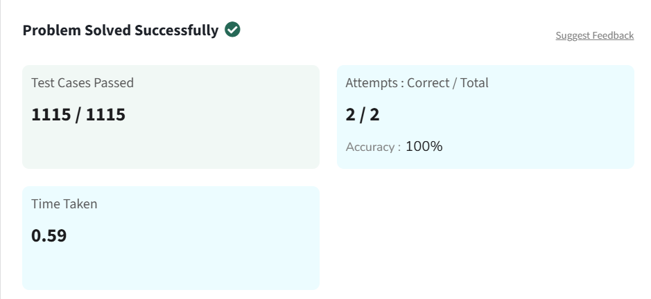

# Largest in Array

Given an array `arr[]`. The task is to find the **largest element** and return it.

---

## Examples

**Input:**  
arr[] = [1, 8, 7, 56, 90]

**Output:**  
90

**Explanation:**  
The largest element of the given array is **90**.

---

**Input:**  
arr[] = [5, 5, 5, 5]

**Output:**  
5

**Explanation:**  
The largest element of the given array is **5**.

---

**Input:**  
arr[] = [10]

**Output:**  
10

**Explanation:**  
There is only one element which is the largest.

---

## Constraints

1 ≤ arr.size() ≤ 10⁶  
0 ≤ arr[i] ≤ 10⁶  

---

## Solution

```python
class Solution:
    def largest(self, arr):
        max_val = arr[0]
        
        for i in arr:
            if i > max_val:
                max_val = i
                
        return max_val
```

## Problem Solved Screenshot

