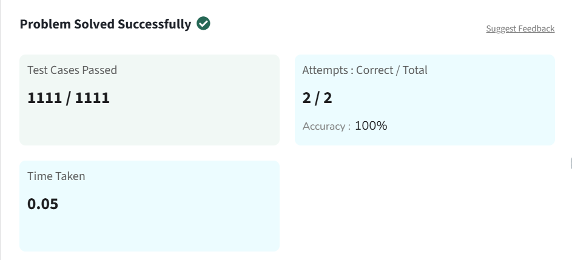

# Min and Max in Array

## Problem Statement

Given an array `arr[]`. Your task is to find the **minimum and maximum elements** in the array.

---

## Examples

**Input:**  
arr[] = [1, 4, 3, 5, 8, 6]

**Output:**  
[1, 8]

**Explanation:**  
The minimum and maximum elements of the array are **1** and **8**.

---

**Input:**  
arr[] = [12, 3, 15, 7, 9]

**Output:**  
[3, 15]

**Explanation:**  
The minimum and maximum elements of the array are **3** and **15**.

---

## Constraints

- 1 ≤ arr.size() ≤ 10⁵  
- 1 ≤ arr[i] ≤ 10⁹  

---

## Solution (Python)

```python
class Solution:
    def getMinMax(self, arr):
        min_val = arr[0]
        max_val = arr[0]

        for num in arr:
            if num < min_val:
                min_val = num
            if num > max_val:
                max_val = num

        return min_val, max_val

```

## Problem Solved Screenshot

