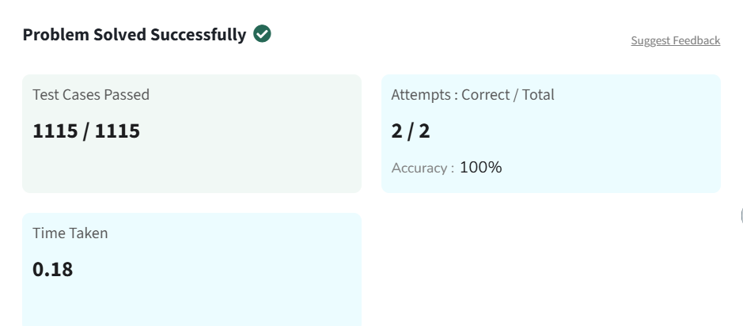

# Rotate Array by One

Given an array `arr`, rotate the array by **one position in clockwise direction**.

---

## Examples

**Input:**  
arr[] = [1, 2, 3, 4, 5]

**Output:**  
[5, 1, 2, 3, 4]

**Explanation:**  
If we rotate arr by one position in clockwise direction, **5 comes to the front** and the remaining elements shift to the right.

---

**Input:**  
arr[] = [9, 8, 7, 6, 4, 2, 1, 3]

**Output:**  
[3, 9, 8, 7, 6, 4, 2, 1]

**Explanation:**  
After rotating clockwise, **3 moves to the first position**.

---

## Constraints

1 ≤ arr.size() ≤ 10⁵  
0 ≤ arr[i] ≤ 10⁵  

---

## Solution

```python
class Solution:
    def rotate(self, arr):
        last = arr[-1]
        
        for i in range(len(arr)-1, 0, -1):
            arr[i] = arr[i-1]
            
        arr[0] = last
        return arr
```

## Problem Solved Screenshot

